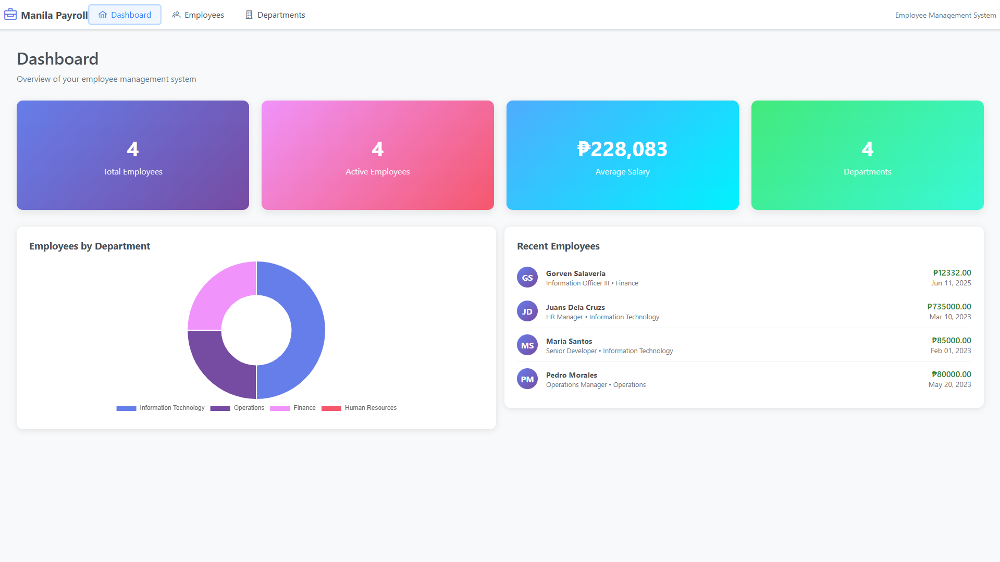
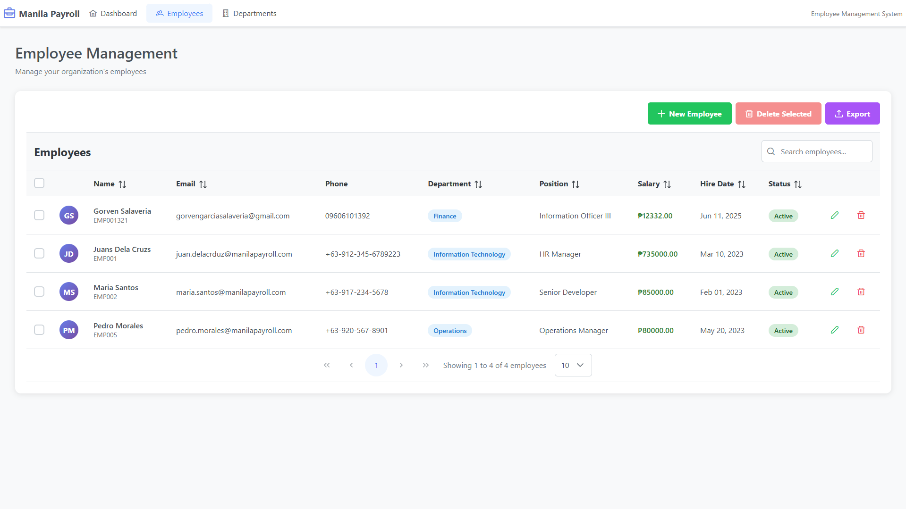
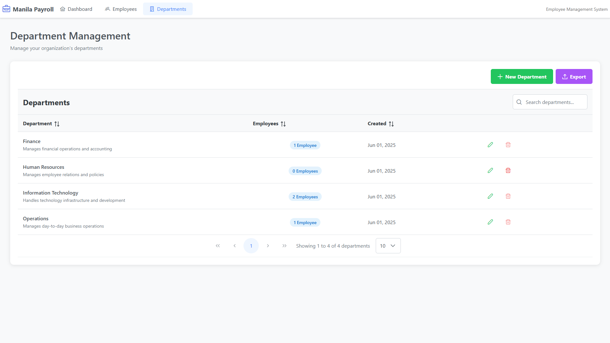

# 🎉 **Manila Payroll Master File – CRUD Application**

A modern, full-stack **Employee & Department Management System** inspired by ManilaPayroll.com, built with:

* **Backend:** Node.js, Express, MySQL
* **Frontend:** React, PrimeReact

<br />

---

## 🌈 **Features**

* **Dashboard** with analytics and recent employee records
* **Employee Master Table** with create, read, update, delete (CRUD)
* **Department Management** (CRUD)
* **Search, Sort, Filter** for both tables
* **Responsive UI** with PrimeReact components
* **Validation & Friendly Error Messages**
* **Data Export** feature

<br />

---

## 🚀 **Screenshots**

### **Dashboard**



### **Employee Management**



### **Department Management**




<br />

---

## 🛠 **How to Run the Project**

### **Backend Setup**

```bash
cd backend
npm install
npm start
```

### **Frontend Setup**

```bash
cd frontend
npm install
npm start
```

The frontend will run by default at [http://localhost:3001](http://localhost:3001).

> **Note:**
>
> * Make sure your MySQL server is running and credentials are correct in `backend/.env`.
> * Default API URL for frontend: `REACT_APP_API_URL=http://localhost:3001/api` (set in `frontend/.env`).

---

## 📦 **Project Structure**

```
Manila_Payroll/
  ├── backend/
  │   ├── routes/
  │   ├── src/
  │   ├── node_modules/
  │   └── ...
  └── frontend/
      ├── src/
      ├── node_modules/
      └── ...
```

---

## ✨ **Credits & Author**

* **Developed by:** [Gorven Salaveria](https://github.com/gorvensalaveria)
* **Coding Challenge for:** Jimmy Dagum, Jimmyzel Software

---

## 📄 **License**

This project is for assessment/demo purposes only.

---

**Good luck, and thank you for checking out the project!**
